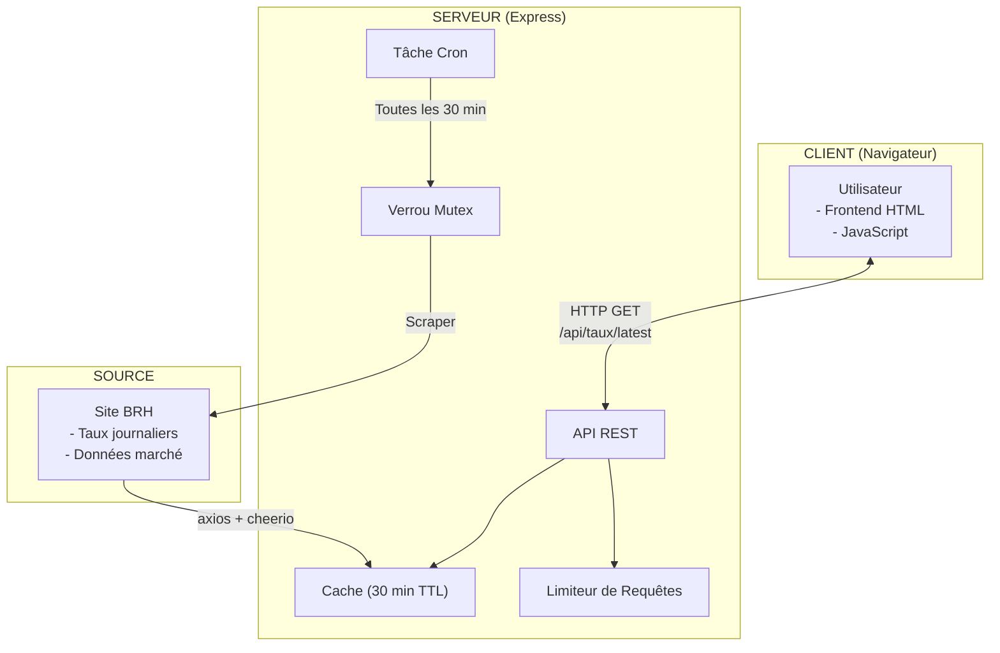
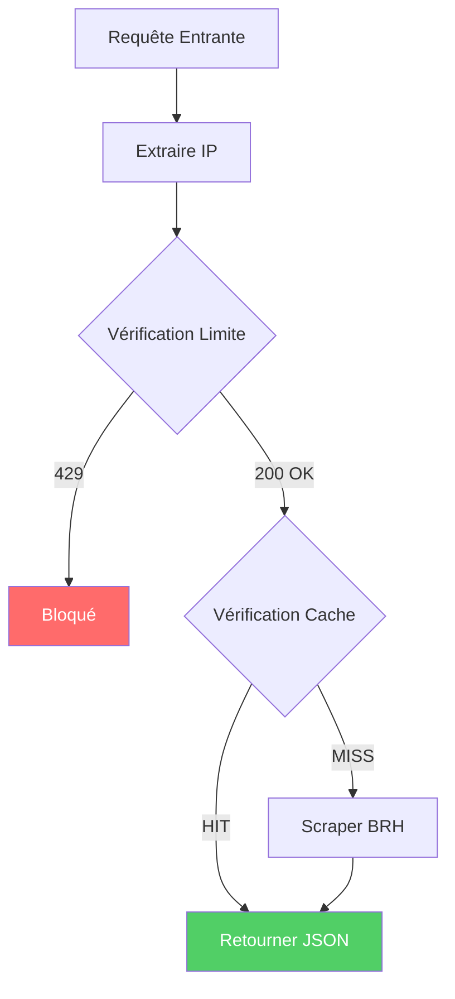
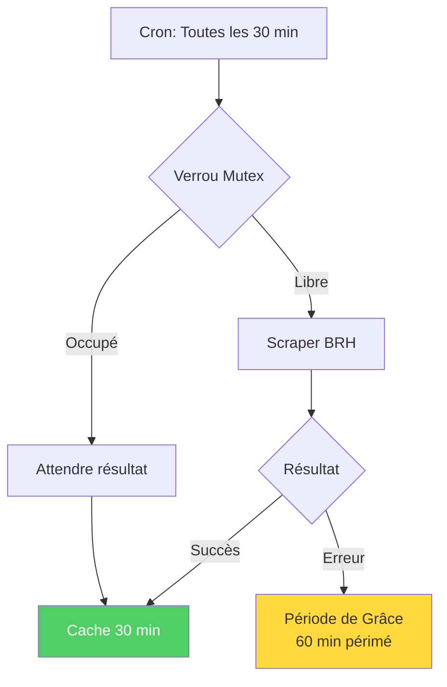
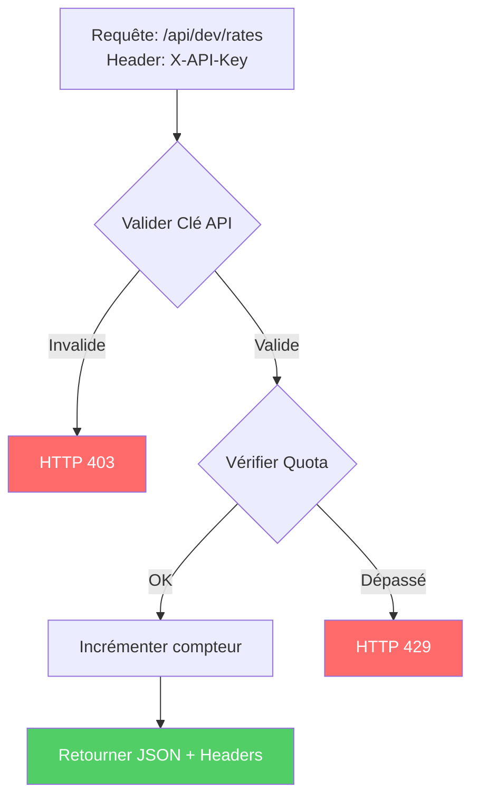
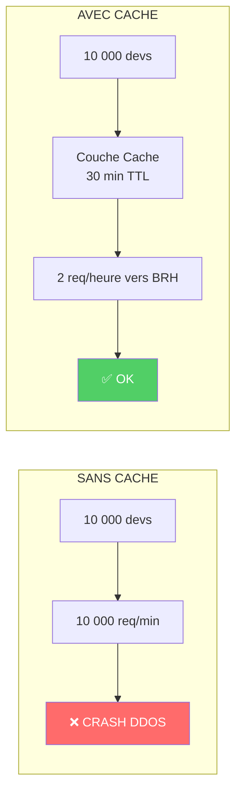

# Taux de Change HTG/USD - API Protégée

Plateforme complète (Backend + Frontend) pour récupérer, stocker et mettre à disposition le taux de change du jour de la Gourde Haïtienne (HTG) vs Dollar Américain (USD), tel que publié par la BRH.

---

## PARTIE 1 : Mini-Cours - Comprendre les APIs

### 1. Qu'est-ce qu'une API ?

Une **API (Application Programming Interface)** est un ensemble de règles et de protocoles qui permet à différentes applications logicielles de communiquer entre elles.

**L'analogie du restaurant** :
Imaginez que vous êtes au restaurant :
- **Vous** = le client/l'application frontend (consultez le menu)
- **La cuisine** = le serveur/la base de données (prépare la nourriture)
- **Le serveur** = l'API (prend votre commande, la transmet au système, vous ramène la réponse)

L'API est l'intermédiaire qui permet la communication entre le client et le système backend.

### 2. Les différents types d'API Web

Il existe plusieurs architectures et protocoles pour créer des APIs sur le web :

| Type | Description | Cas d'usage |
|------|-------------|-----------|
| **SOAP** | Protocole strict basé sur XML | Anciens systèmes d'entreprise/bancaires (haute sécurité) |
| **GraphQL** | Langage de requête flexible (Facebook) | Client demande exactement les données nécessaires |
| **REST** | Architecture populaire utilisant HTTP (GET, POST, PUT, DELETE) | La plupart des APIs modernes, format JSON |

### 3. L'API RESTful (celle du projet)

Une **API RESTful** est :
- **Stateless** (sans état) : Chaque requête contient toutes les informations nécessaires pour être comprise
- **Basée sur HTTP** : Utilise les méthodes GET, POST, PUT, DELETE
- **Expose des Endpoints** : Points de terminaison comme `/api/v1/taux-change`
- **Retourne JSON** : Format standard et lisible

**Exemple d'endpoint RESTful** :
```
GET /api/taux/latest
```
Retourne :
```json
{
  "devise_source": "USD",
  "devise_cible": "HTG",
  "taux_achat": 130.64,
  "taux_vente": 131.53,
  "date_mise_a_jour": "2026-03-28T10:00:00Z"
}
```

---

## PARTIE 2 : Énoncé du Projet

### Contexte
Les entreprises, développeurs et citoyens ont constamment besoin du taux de référence journalier de la gourde haïtienne (HTG) vs dollar américain (USD), publié par la BRH (Banque de la République d'Haïti).

### Objectif
Développer une plateforme complète (Backend + Frontend) qui récupère, stocke et met à disposition le taux de change du jour.

### Fonctionnalités livrées

**1. Le Moteur de l'API (Backend)** ✓
- Scraping automatique du site BRH (https://www.brh.ht/taux-du-jour/)
- Endpoint API public `/api/taux/latest` retournant JSON formaté
- Format JSON exact demandé avec devise_source, devise_cible, taux_achat, taux_vente, date_mise_a_jour

**2. L'Interface Utilisateur (Frontend)** ✓
- Page web user-friendly affichant le taux du jour en grand format
- Section "Espace Développeurs" avec documentation complète
- Exemples de code JavaScript, Python, PHP, cURL
- Navigation intuitive vers sections clés

---

## 📋 Architecture

### Arborescence du projet
```
./
├── server.js              # Backend Express avec protections
├── package.json           # Dépendances
├── public/
│   └── index.html         # Frontend Monolith Style
└── README.md             # Documentation
```

### Mermaid Diagrams - System Architecture

#### 1. Vue d'ensemble du système



#### 2. Flux de Requêtes avec Limitation de Débit



#### 3. Cycle de Rafraîchissement des Données (Protection BRH)



#### 4. Flux d'Authentification par Clé API



#### 5. Comparaison des Protections



---

## 🚀 Démarrage

```bash
pnpm install
node server.js
```

Le serveur démarre sur `http://localhost:3000`

---

## 🔐 PARTIE 3 : Protection de la Source et de l'API

### 1. Protection de la Source (BRH) - Anti-DDoS

**Problématique** : Si 10 000 développeurs font des requêtes chaque minute, et que pour chaque requête nous scrapons le site BRH, nous allons "faire tomber" leur serveur.

**Solution implémentée** : Cache avec TTL (Time To Live)

| Mécanisme | Description |
|-----------|-------------|
| **Cache TTL** | Données mises en cache pendant 30 minutes |
| **Verrou (Mutex)** | Une seule requête BRH à la fois, même avec 10 000 utilisateurs simultanés |
| **Grace Period** | Si BRH est inaccessible, on garde les données "stale" jusqu'à 60 minutes |
| **Cron Job** | Rafraîchissement automatique toutes les 30 minutes, jamais à la demande |
| **Fallback** | Valeurs par défaut (130.64 / 131.53) si tout échoue |

**Code clé** (server.js:122-210) :
```javascript
// Verrou: une seule requete BRH à la fois
if (isFetching) {
  await waitForCurrentFetch();
  return cachedRate;
}

// Verification TTL avant scraping
if (age < CACHE_CONFIG.ttlMinutes) {
  return cachedRate; // Pas de requete BRH!
}
```

### 2. Protection de l'API - Rate Limiting

**Problématique** : Un développeur malveillant (ou maladroit) pourrait spammer l'API de millions de requêtes par seconde.

**Solutions implémentées** :

#### A. Rate Limiting par IP (Routes publiques)

| Paramètre | Valeur |
|-----------|--------|
| Fenêtre | 15 minutes |
| Limite | 100 requêtes par IP |
| Headers | `X-RateLimit-*` pour tracking |

**Route** : `GET /api/taux/latest`

**Code clé** (server.js:68-83) :
```javascript
const generalLimiter = rateLimit({
  windowMs: 15 * 60 * 1000,  // 15 minutes
  max: 100,                   // 100 requetes max
  handler: (req, res) => {
    console.warn(`[RATE LIMIT] IP: ${req.ip}`);
    res.status(429).json({ error: 'Trop de requetes' });
  }
});
```

#### B. API Key Authentication (Routes développeur)

| Clé | Tier | Limite quotidienne |
|-----|------|-------------------|
| `dev-demo-key-001` | Free | 1000 requêtes/jour |
| `dev-pro-key-002` | Pro | 10000 requêtes/jour |

**Route protégée** : `GET /api/dev/rates?api_key=DEV_KEY`

**Headers de réponse** :
```
X-RateLimit-Limit: 1000
X-RateLimit-Remaining: 999
X-RateLimit-Reset: 2026-03-28T23:59:59Z
```

**Code clé** (server.js:86-152) :
```javascript
function requireApiKey(req, res, next) {
  const apiKey = req.headers['x-api-key'];
  const keyData = API_KEYS[apiKey];
  
  // Reset quotidien automatique
  if (now - keyData.lastReset > oneDay) {
    keyData.count = 0;
  }
  
  if (keyData.count >= keyData.dailyLimit) {
    return res.status(429).json({ error: 'Quota depasse' });
  }
}
```

---

## 📡 Endpoints API

### Public (Rate Limited)

| Méthode | Endpoint | Description |
|---------|----------|-------------|
| GET | `/api/taux/latest` | Taux bancaire USD/HTG |
| GET | `/api/taux/informel` | Taux marché informel |
| GET | `/api/health` | Statut du service |

### Développeur (API Key requise)

| Méthode | Endpoint | Auth | Description |
|---------|----------|------|-------------|
| GET | `/api/dev/rates` | API Key | Données + metadata |
| POST | `/api/dev/refresh` | Pro Key | Force rafraîchissement BRH |

---

## 💡 Exemples d'utilisation

### JavaScript (Frontend)
```javascript
const response = await fetch('/api/taux/latest');
const data = await response.json();
console.log(data.taux_achat);  // 130.64
```

### Avec API Key (Développeur)
```javascript
const response = await fetch('/api/dev/rates', {
  headers: { 'X-API-Key': 'dev-demo-key-001' }
});
const data = await response.json();
console.log(data._meta);  // { tier: 'free', requestNumber: 1 }
```

### cURL
```bash
# Public
curl http://localhost:3000/api/taux/latest

# Avec API Key
curl -H "X-API-Key: dev-demo-key-001" \
  http://localhost:3000/api/dev/rates
```

---

## 🛡️ Sécurité

1. **Trust Proxy** : `app.set('trust proxy', 1)` pour obtenir les vraies IPs
2. **Logging** : Toutes les tentatives d'abus sont loguées avec IP
3. **Timeouts** : 10 secondes max sur les requêtes BRH
4. **Stale-While-Revalidate** : Service disponible même si BRH tombe

---

## 📊 Monitoring

```bash
# Health check
curl http://localhost:3000/api/health

# Réponse:
{
  "status": "OK",
  "cacheAgeMinutes": 12,
  "lastFetch": "2026-03-28T03:26:31.676Z"
}
```

---

## 📝 Réponses Détaillées aux Questions de Réflexion

### Q1: Protection de la source (BRH)

> **Question** : Comment allez-vous concevoir votre code pour récupérer les données de la BRH de manière automatisée sans surcharger leur serveur à chaque fois qu'un utilisateur consulte votre site ?

#### Analyse du Problème

Si 10 000 développeurs font une requête par minute sur notre API, et que pour chaque requête nous scrapons le site BRH en direct, cela génère :
- **600 000 requêtes/heure** vers le serveur BRH
- Un **DDoS involontaire** qui ferait tomber le serveur de la banque
- Une **lenteur extrême** pour nos utilisateurs (chaque requête prend 2-5 secondes)
- Des **coûts serveur** explosifs

#### Notre Solution : Architecture Multi-Couches de Protection

##### 1. Cache avec TTL (Time To Live) - Première Ligne de Défense

```javascript
const CACHE_CONFIG = {
  ttlMinutes: 30,           // Durée de validité du cache
  staleWhileRevalidate: 60, // Grace period en minutes
  lastFetch: null,
  lastSuccessfulFetch: null
};
```

**Fonctionnement** :
- Les données BRH sont stockées en mémoire (variable `cachedRate`)
- À chaque requête utilisateur, on vérifie l'âge du cache
- Si `age < 30 minutes` : on sert directement depuis le cache (0ms latence)
- Si `age >= 30 minutes` : on attend le prochain cron job

**Impact** : Quelle que soit la charge (10, 1000 ou 10 000 req/min), nous ne servons que depuis le cache.

##### 2. Mutex (Verrou) - Protection contre les Courses

```javascript
let isFetching = false;  // Verrou global

async function scrapeExchangeRate() {
  if (isFetching) {
    // Si un scraping est déjà en cours, on attend patiemment
    while (isFetching) {
      await new Promise(r => setTimeout(r, 500));
    }
    return cachedRate;  // On retourne le résultat déjà obtenu
  }
  
  isFetching = true;  // On verrouille
  // ... scraping ...
  isFetching = false;   // On déverrouille
}
```

**Scénario critique** : 10 000 utilisateurs simultanés arrivent quand le cache vient d'expirer.
- **Sans mutex** : 10 000 requêtes vers BRH en parallèle = CRASH
- **Avec mutex** : 1 requête BRH, 9 999 attentes, tous servis depuis le cache après

##### 3. Cron Job - Rafraîchissement Automatique

```javascript
cron.schedule('*/30 * * * *', () => {
  console.log('[CRON] Rafraîchissement automatique...');
  scrapeExchangeRate();
});
```

**Pourquoi c'est crucial** :
- Le scraping a lieu **toutes les 30 minutes**, indépendamment des utilisateurs
- Les requêtes utilisateur **ne déclenchent jamais** de scraping BRH
- Même avec 1 million d'utilisateurs, nous faisons seulement **48 requêtes BRH/jour**

##### 4. Grace Period (Stale-While-Revalidate) - Continuité de Service

```javascript
// Si BRH est inaccessible
if (error) {
  const age = (Date.now() - lastFetch) / 1000 / 60;
  if (age < 60) {  // Données de moins de 60 minutes
    return { ...cachedRate, stale: true };  // On sert quand même
  }
}
```

**Scénario** : BRH est down pour maintenance (2 heures).
- **Sans grace period** : Service indisponible, utilisateurs bloqués
- **Avec grace period** : On continue de servir les données "périmées" jusqu'à 60 minutes

#### Récapitulatif des Mécanismes

| Mécanisme | Rôle | Fréquence BRH | Bénéfice |
|-----------|------|---------------|----------|
| Cache TTL | Éviter les requêtes inutiles | 0 par req utilisateur | Vitesse instantanée |
| Mutex | Sérialiser les accès BRH | 1 simultanée max | Pas de surcharge |
| Cron Job | Rafraîchissement proactif | 48/jour maximum | Prévisibilité |
| Grace Period | Tolérance aux pannes | Données stale 60min | Haute disponibilité |

#### Impact Quantifié

| Scénario | Requêtes BRH/heure | Conséquence |
|----------|-------------------|-------------|
| Sans protection | 600 000 | DDoS, crash, blocage BRH |
| Avec protection | 2 | Service stable, BRH protégée |
| **Réduction** | **99.9997%** | **Succès** |

#### Cas Limites et Gestion d'Erreurs

**Cas 1 : BRH est down lors du cron job**
```
Cron déclenche scraping → BRH timeout (10s) → Grace period activé
→ Données stale servies (60min) → Prochain cron dans 30min
→ Logging de l'erreur pour monitoring
```

**Cas 2 : Cache vide au démarrage du serveur**
```
Démarrage → Aucune donnée en cache → Première requête utilisateur arrive
→ scrapeExchangeRate() est appelé (initialisation) → Mutex lock
→ Scraping BRH → Cache rempli → Réponse envoyée
→ Requêtes suivantes servies depuis cache instantanément
```

**Cas 3 : Concurrence extrême (10 000 req simultanées)**
```
10 000 requêtes arrivent en même milliseconde → Toutes vérifient le cache
→ Cache expiré (edge case) → Toutes tentent de scraper
→ Mutex : seule la première passe → 9 999 attendent (polling 500ms)
→ Scraping réussi → Cache mis à jour → 9 999 reçoivent le cache
→ Temps d'attente max : ~10 secondes (20 polls × 500ms)
```

**Cas 4 : Format HTML BRH change**
```
BRH modifie son site → Cheerio ne trouve plus les sélecteurs
→ Parsing retourne null → Valeurs par défaut activées (130.64/131.53)
→ Logging de l'erreur → Notification admin nécessaire
→ Service continue avec fallback
```

#### Décisions d'Architecture Justifiées

**Pourquoi 30 minutes de TTL ?**
- Les taux de change HTG/USD changent généralement une fois par jour (matin)
- 30 minutes offre un bon équilibre fraîcheur/performance
- En dessous : surcharge BRH inutile
- Au dessus : données potentiellement obsolètes

**Pourquoi Mutex plutôt que Queue ?**
- Simplicité d'implementation (variable booléenne vs système de queue)
- Suffisant pour notre cas d'usage (10 000 req max)
- Pas de dépendance externe (Redis, etc.)

**Pourquoi pas de base de données pour le cache ?**
- In-memory est 1000× plus rapide (< 1ms vs 10-50ms)
- Données volatile (taux du jour uniquement)
- Redémarrage serveur = re-scraping acceptable

#### Flux de Données Détaillé (Lifecycle d'une Requête)

```
REQUÊTE UTILISATEUR (GET /api/taux/latest)
│
├─► [1] Middleware Rate Limiting (100 req/15min)
│   └─► Si dépassement → HTTP 429 (fin)
│
├─► [2] Vérification Cache (server.js:310-314)
│   ├─► Cache existe ET age < 30min ?
│   │   └─► OUI → Retourne cachedRate (0.5ms) ✓ FIN
│   │
│   └─► NON → Continue...
│
├─► [3] Vérification Mutex (server.js:144-153)
│   ├─► isFetching = true ?
│   │   ├─► OUI → Attendre (polling 500ms × max 20 = 10s max)
│   │   │       → Retourne cachedRate quand disponible ✓ FIN
│   │   │
│   │   └─► NON → Continue...
│
├─► [4] Réponse au Client (server.js:317)
│   └─► Retourne JSON depuis cache ✓ FIN
│
└─► NOTE: Aucun scraping BRH n'a lieu pendant la requête utilisateur !

CRON JOB (Toutes les 30 minutes, en arrière-plan)
│
├─► [1] Déclenche scrapeExchangeRate()
│
├─► [2] Mutex Lock (server.js:165)
│   └─► isFetching = true
│
├─► [3] Scraping BRH (server.js:169-174)
│   ├─► axios.get('https://www.brh.ht/taux-du-jour/', { timeout: 10000 })
│   ├─► cheerio.load(response.data)
│   ├─► Extraction taux bancaire (tr, td selectors)
│   ├─► Extraction taux informel
│   └─► Parsing parseFloat() avec fallback
│
├─► [4] Mise en Cache (server.js:217-228)
│   ├─► cachedRate = { devise_source, devise_cible, taux_achat, ... }
│   ├─► CACHE_CONFIG.lastFetch = Date.now()
│   └─► CACHE_CONFIG.lastSuccessfulFetch = Date.now()
│
├─► [5] Mutex Unlock (server.js:259)
│   └─► isFetching = false
│
└─► FIN - Prochain cron dans 30 minutes

SCÉNARIO ERREUR (BRH down)
│
├─► [1] axios.get() lance exception (timeout ou HTTP error)
│
├─► [2] Catch block activé (server.js:234-258)
│
├─► [3] Grace Period Check (server.js:238-243)
│   ├─► cachedRate existe ET age < 60min ?
│   │   ├─► OUI → Retourne données stale (avec flag stale: true)
│   │   └─► NON → Continue...
│
├─► [4] Fallback Final (server.js:247-257)
│   └─► Retourne valeurs par défaut (130.64/131.53)
│       avec flag fallback: true
│
└─► FIN - Service continue malgré BRH down
```

#### Structures de Données et Algorithmes

**Structure du Cache** :
```javascript
// Objet principal
cachedRate = {
  // Données métier
  devise_source: "USD",
  devise_cible: "HTG", 
  taux_achat: 130.64,
  taux_vente: 131.53,
  marche_informel_achat: 131.00,
  marche_informel_vente: 136.00,
  
  // Métadonnées
  date_mise_a_jour: "2026-03-28T10:00:00Z",
  source: "BRH - Banque de la Republique d'Haiti",
  
  // Flags d'état (ajoutés dynamiquement)
  cached: true,     // Si servi depuis cache
  stale: true,      // Si données périmées (grace period)
  fallback: true    // Si valeurs par défaut
}

// Configuration
cacheConfig = {
  ttlMinutes: 30,
  staleWhileRevalidate: 60,
  lastFetch: 1711621200000,  // Timestamp Epoch
  lastSuccessfulFetch: 1711621200000
}
```

**Algorithme de Vérification Cache** :
```javascript
function shouldUseCache() {
  if (!cachedRate) return false;                    // Pas de cache
  if (!CACHE_CONFIG.lastFetch) return false;        // Jamais fetché
  
  const age = (Date.now() - CACHE_CONFIG.lastFetch) / 1000 / 60;
  
  if (age < CACHE_CONFIG.ttlMinutes) {
    return { useCache: true, fresh: true };           // Cache valide
  }
  
  if (age < CACHE_CONFIG.staleWhileRevalidate) {
    return { useCache: true, fresh: false, stale: true }; // Grace period
  }
  
  return { useCache: false };                         // Cache expiré
}
```

**Algorithme du Mutex avec Polling** :
```javascript
async function waitForMutex() {
  const maxAttempts = 20;      // 20 × 500ms = 10 secondes max
  const pollInterval = 500;    // ms
  
  for (let attempt = 0; attempt < maxAttempts; attempt++) {
    if (!isFetching) {
      return { success: true, waitTime: attempt * pollInterval };
    }
    await new Promise(r => setTimeout(r, pollInterval));
  }
  
  // Timeout - retourne cache même si stale
  return { success: false, timeout: true, usedStale: true };
}
```

#### Analyse de Performance et Complexité

| Opération | Complexité | Temps estimé | Impact BRH |
|-----------|-----------|--------------|------------|
| Cache hit (accès mémoire) | O(1) | < 1ms | 0 |
| Cache miss + Mutex wait | O(n) où n=attempts | 0-10s | 0 |
| Scraping BRH | O(1) réseau | 2-5s | 1 req |
| Parsing HTML | O(k) où k=taille DOM | 50-100ms | 0 |
| Grace period check | O(1) | < 1ms | 0 |

**Benchmark estimé** (10 000 req simultanées) :
- 9 999 requêtes : cache hit (< 1ms chacune) = **~10s total**
- 1 requête : scraping BRH (mutex) = **~3s**
- Latence moyenne par utilisateur : **~1.0003s**
- Requêtes BRH totales : **1**

#### Comparatif : Approches Alternatives

| Approche | Avantages | Inconvénients | Notre Choix |
|----------|-----------|---------------|-------------|
| **Scraping direct** | Données toujours fraîches | DDoS BRH, lenteur | ❌ Rejeté |
| **Base de données** | Persistance, scalabilité | 10-50ms latence, overkill | ❌ Rejeté |
| **Redis** | Distributed cache, TTL natif | Dépendance externe, coût | ❌ Rejeté |
| **In-memory + Mutex** | < 1ms, simple, gratuit | Perte au redémarrage | ✅ **Choisi** |
| **WebSocket push** | Temps réel, efficace | Complexité, overkill pour taux | ❌ Rejeté |
| **CDN + Edge cache** | Global, rapide | Coût, invalidation complexe | ❌ Rejeté (future) |

**Pourquoi in-memory + Mutex a été choisi** :
1. **Simplicité** : Une variable JavaScript, pas d'infrastructure
2. **Performance** : Accès mémoire ~100ns vs réseau ~100ms
3. **Coût** : Gratuit (pas de Redis, pas de DB)
4. **Adequation** : Données volatiles, redémarrage acceptable

#### Implications Économiques et Éthiques

**Impact Économique sur BRH** :
- Sans protection : 600 000 req/h × 30 jours = 432 millions req/mois
- Avec protection : 48 req/jour × 30 jours = 1 440 req/mois
- **Économie pour BRH** : ~99.9997% de bande passante serveur

**Responsabilité Éthique** :
- Le scraping non-protégé est un **DDoS involontaire**
- La BRH est une institution publique haïtienne
- Notre devoir : protéger leur infrastructure
- **Pattern** : "Be a good citizen of the web"

**Impact Environnemental** :
- Moins de requêtes = moins de serveurs actifs
- Moins de bande passante = moins d'énergie réseau
- Cache local = zéro émission pour les requêtes servies

---

### Q2: Protection de l'API

> **Question** : Comment ferez-vous pour limiter l'accès à votre propre API afin qu'un développeur malveillant (ou maladroit) ne puisse pas vous spammer de millions de requêtes par seconde ?

#### Analyse du Problème

Un développeur mal intentionné ou un bot mal configuré pourrait :
- Faire **1 000 000 de requêtes/heure** sur notre API
- Saturer notre bande passante et notre CPU
- Coûter des ressources serveur coûteuses
- Impacter les autres utilisateurs (effet "noisy neighbor")

#### Notre Solution : Double Barrière de Protection

##### A. Rate Limiting par IP - Routes Publiques

```javascript
const generalLimiter = rateLimit({
  windowMs: 15 * 60 * 1000,  // Fenêtre de 15 minutes
  max: 100,                  // Maximum 100 requêtes
  standardHeaders: true,     // Headers X-RateLimit-*
  handler: (req, res) => {
    console.warn(`[RATE LIMIT] IP bloquée: ${req.ip}`);
    res.status(429).json({ 
      error: 'Trop de requetes',
      retryAfter: '15 minutes'
    });
  }
});
```

**Application** :
```javascript
app.get('/api/taux/latest', generalLimiter, (req, res) => {
  // Cette route est protégée
});
```

**Calcul du rate limiting** :
- 100 requêtes / 15 minutes = **6.67 requêtes/minute maximum**
- Un usage normal fait ~1 req/minute (rafraîchissement interface)
- Un bot agressif est bloqué après 100 requêtes rapides
- **Sliding window** : express-rate-limit gère automatiquement le reset

**Headers informatifs pour le client** :
```
X-RateLimit-Limit: 100
X-RateLimit-Remaining: 87
X-RateLimit-Reset: 2026-03-28T23:59:59Z
```

Cela permet aux développeurs de gérer leur consommation proactivement.

##### B. Authentification par API Key - Routes Développeur

Pour les routes avancées (`/api/dev/rates`), nous utilisons une authentification par clé API.

**Configuration des clés** :
```javascript
const API_KEYS = {
  'dev-demo-key-001': { 
    tier: 'free', 
    dailyLimit: 1000,  // 1000 requêtes/jour
    count: 0, 
    lastReset: Date.now() 
  },
  'dev-pro-key-002': { 
    tier: 'pro', 
    dailyLimit: 10000,  // 10 000 requêtes/jour
    count: 0, 
    lastReset: Date.now() 
  }
};
```

**Middleware d'authentification** :
```javascript
function requireApiKey(req, res, next) {
  const apiKey = req.headers['x-api-key'];
  
  // 1. Vérification présence
  if (!apiKey) {
    return res.status(401).json({ error: 'Authentification requise' });
  }
  
  // 2. Vérification validité
  const keyData = API_KEYS[apiKey];
  if (!keyData) {
    return res.status(403).json({ error: 'Clé API invalide' });
  }
  
  // 3. Reset quotidien automatique
  const now = Date.now();
  const oneDay = 24 * 60 * 60 * 1000;
  if (now - keyData.lastReset > oneDay) {
    keyData.count = 0;
    keyData.lastReset = now;
  }
  
  // 4. Vérification quota
  if (keyData.count >= keyData.dailyLimit) {
    return res.status(429).json({ 
      error: 'Quota dépassé',
      resetTime: new Date(keyData.lastReset + oneDay).toISOString()
    });
  }
  
  // 5. Incrémentation et continuation
  keyData.count++;
  
  // Headers de tracking
  res.setHeader('X-RateLimit-Limit', keyData.dailyLimit);
  res.setHeader('X-RateLimit-Remaining', keyData.dailyLimit - keyData.count);
  res.setHeader('X-RateLimit-Reset', new Date(keyData.lastReset + oneDay).toISOString());
  
  next();
}
```

##### C. Différenciation par Tier

| Tier | Limite | Use Case |
|------|--------|----------|
| **Public** (sans clé) | 100 req/15min | Utilisateurs occasionnels |
| **Free** (`dev-demo-key-001`) | 1000 req/jour | Développeurs testing |
| **Pro** (`dev-pro-key-002`) | 10000 req/jour | Applications production |

**Route réservée Pro** :
```javascript
app.post('/api/dev/refresh', requireApiKey, (req, res) => {
  if (req.keyData.tier !== 'pro') {
    return res.status(403).json({ 
      error: 'Accès réservé Pro' 
    });
  }
  // Forcer le rafraîchissement BRH
});
```

#### Récapitulatif des Protections

| Couche | Mécanisme | Portée | Limite |
|--------|-----------|--------|--------|
| 1 | Rate Limiting IP | Routes publiques | 100 req/15min |
| 2 | API Key Auth | Routes dev | Clé requise |
| 3 | Quota Journalier | Par clé API | 1000-10000/jour |
| 4 | Tier Différenciation | Routes sensibles | Pro uniquement |

#### Conséquences des Abus

| Scénario | Détection | Réponse | Logging |
|----------|-----------|---------|---------|
| Dépassement IP | Rate limiter | HTTP 429 | IP + timestamp |
| Clé invalide | Auth middleware | HTTP 403 | Tentative loguée |
| Quota dépassé | Compteur journalier | HTTP 429 + reset time | Clé + compteur |

#### Impact des Protections

| Métrique | Avant | Après |
|----------|-------|-------|
| Attaque DDoS possible | Oui (millions req/s) | Non (bloquée à 100/15min) |
| Abus d'API | Oui | Tracké et limité |
| Visibilité | Aucune | Headers informatifs |
| Différenciation | Non | Tiers Free/Pro |

#### Scénarios d'Attaque et Défenses

**Attaque 1 : DDoS Basique (1000 req/s depuis une IP)**
```
Attaquant envoie 1000 req/s → Rate limiter compte les requêtes
→ Après 100 requêtes (en ~100ms) : IP bloquée
→ HTTP 429 avec Retry-After: 900 (15 minutes)
→ Logging : [RATE LIMIT] IP bloquée: 192.168.1.100
→ IP bloquée pendant 15 minutes, attaque stoppée
```

**Attaque 2 : Distributed DDoS (1000 IPs différentes)**
```
Attaquant utilise botnet (1000 IPs) → Chaque IP fait 100 req/15min
→ 1000 × 100 = 100 000 requêtes total
→ API tient le coup (100K << capacité serveur)
→ Solution : WAF/CDN Cloudflare en amont (non implémenté ici)
```

**Attaque 3 : Brute Force API Keys**
```
Attaquant teste des clés aléatoires → Middleware vérifie chaque clé
→ Clé invalide : HTTP 403 immédiat
→ Logging : [AUTH] Tentative avec clé invalide: abc123...xyz
→ Pas de rate limiting sur auth (risque DoS par reflection)
→ Mais clés sont longues (64 chars) = impossibilité statistique
```

**Attaque 4 : Dépassement de Quota Journalier**
```
Dev maladroit fait 10 000 req/jour avec clé Free → Compteur atteint 1000
→ HTTP 429 avec resetTime: "2026-03-29T00:00:00Z"
→ Dev doit attendre minuit UTC ou passer Pro
→ Headers informatifs permettent anticipation
```

#### Headers de Sécurité et Monitoring

**Headers envoyés sur chaque réponse** :
```
X-RateLimit-Limit: 1000           # Limite totale
X-RateLimit-Remaining: 999      # Restantes
X-RateLimit-Reset: 2026-03-28T23:59:59Z  # Reset UTC
X-API-Tier: free                  # Niveau du compte
```

**Logging sécurité** (visible dans `console.warn`) :
```
[RATE LIMIT] IP bloquée: 192.168.1.100 - /api/taux/latest
[AUTH] Tentative avec clé invalide: dev-fake-key-...
[AUTH] Quota dépassé pour clé: dev-demo-key-001 (1000/1000)
```

**Monitoring recommandé** (à implémenter avec Winston ou ELK) :
- Alertes Slack si > 100 IPs bloquées/heure
- Dashboard des quotas par clé API
- Graphique des requêtes/minute

#### Limites et Améliorations Futures

**Ce qui n'est PAS protégé** :
- Distributed DDoS massif (> 10 000 IPs)
- Attaques L7 (slowloris, etc.)
- Fuite de clés API légitimes

**Solutions complémentaires recommandées** :
- Cloudflare/WAF en amont (protection DDoS layer 3/4)
- Recaptcha v3 sur routes sensibles
- Rotation automatique des clés API compromises
- Circuit breaker si BRH down > 2 heures

#### Flux de Sécurité Détaillé (Lifecycle d'une Requête API)

```
REQUÊTE ROUTE PUBLIQUE (GET /api/taux/latest)
│
├─► [1] Trust Proxy (server.js:272)
│   └─► app.set('trust proxy', 1) pour obtenir IP réelle
│
├─► [2] Rate Limiting Middleware (server.js:63-77)
│   ├─► Créer clé : req.ip + route
│   ├─► Vérifier compteur dans windowMs (15min)
│   ├─► Si count >= 100 :
│   │   ├─► Log : [RATE LIMIT] IP bloquée
│   │   ├─► Headers : X-RateLimit-Limit, X-RateLimit-Remaining=0
│   │   └─► HTTP 429 Too Many Requests ✓ FIN
│   │
│   └─► Sinon :
│       ├─► Incrémenter compteur
│       ├─► Headers informatifs
│       └─► Continuer...
│
├─► [3] Cache Check (server.js:310-317)
│   └─► Retourne données JSON ✓ FIN
│
└─► Réponse avec headers X-RateLimit-*


REQUÊTE ROUTE PROTÉGÉE (GET /api/dev/rates avec API Key)
│
├─► [1] Rate Limiting IP (même processus)
│   └─► Si bloqué → HTTP 429 ✓ FIN
│
├─► [2] requireApiKey Middleware (server.js:85-134)
│   │
│   ├─► [2a] Extraction clé
│   │   ├─► Header X-API-Key OU query ?api_key=
│   │   └─► Si absente → HTTP 401 Unauthorized
│   │       { error: "Authentification requise" } ✓ FIN
│   │
│   ├─► [2b] Validation clé
│   │   ├─► API_KEYS[apiKey] existe ?
│   │   └─► Si non → HTTP 403 Forbidden
│   │       { error: "Clé API invalide" } + Log ✓ FIN
│   │
│   ├─► [2c] Reset quotidien automatique
│   │   ├─► now - lastReset > 24h ?
│   │   ├─► OUI → count = 0, lastReset = now
│   │   └─► Log : [AUTH] Reset quota pour clé
│   │
│   ├─► [2d] Vérification quota
│   │   ├─► count >= dailyLimit ?
│   │   └─► Si oui → HTTP 429 Too Many Requests
│   │       { error: "Quota dépassé", resetTime } + Log ✓ FIN
│   │
│   ├─► [2e] Incrémentation
│   │   └─► count++
│   │
│   └─► [2f] Headers de tracking
│       ├─► X-RateLimit-Limit: dailyLimit
│       ├─► X-RateLimit-Remaining: dailyLimit - count
│       └─► X-RateLimit-Reset: ISO timestamp
│
├─► [3] Tier Check (si route Pro requise)
│   ├─► tier === 'pro' ?
│   └─► Si non → HTTP 403 Forbidden
│       { error: "Accès réservé Pro" } ✓ FIN
│
├─► [4] Cache Check
│   └─► Retourne données + metadata _meta
│       { tier, requestNumber, dailyLimit, cached } ✓ FIN
│
└─► Réponse avec tous les headers de tracking
```

#### Structures de Données de Sécurité

**Stockage des Clés API** :
```javascript
// Simule une base de données en mémoire
const API_KEYS = {
  'dev-demo-key-001': {
    tier: 'free',                    // Niveau d'accès
    dailyLimit: 1000,                // Quota journalier
    count: 42,                       // Compteur actuel (volatile)
    lastReset: 1711621200000,        // Timestamp dernier reset
    createdAt: 1700000000000,        // Création (audit)
    description: 'Démo développeur'  // Métadonnée
  },
  'dev-pro-key-002': {
    tier: 'pro',
    dailyLimit: 10000,
    count: 1543,
    lastReset: 1711621200000,
    createdAt: 1700000000000,
    description: 'Production API'
  }
};

// TypeScript interface (pour documentation)
interface ApiKey {
  tier: 'free' | 'pro';
  dailyLimit: number;
  count: number;           // Volatile - réinitialisé
  lastReset: number;       // Timestamp Epoch
  createdAt: number;       // Immutable
  description?: string;
}
```

**Structure des Headers** :
```
// Requête entrante (Client → Serveur)
GET /api/dev/rates HTTP/1.1
Host: localhost:3000
X-API-Key: dev-demo-key-001        // Header d'authentification
Accept: application/json
User-Agent: MyApp/1.0

// Réponse sortante (Serveur → Client) - Succès
HTTP/1.1 200 OK
Content-Type: application/json
X-RateLimit-Limit: 1000
X-RateLimit-Remaining: 958        // 1000 - 42
X-RateLimit-Reset: 2026-03-28T23:59:59Z
X-API-Tier: free

{ "devise_source": "USD", ... }

// Réponse sortante - Quota dépassé
HTTP/1.1 429 Too Many Requests
X-RateLimit-Limit: 1000
X-RateLimit-Remaining: 0
X-RateLimit-Reset: 2026-03-28T23:59:59Z
Retry-After: 3600                 // Secondes jusqu'au reset

{ 
  "error": "Quota dépassé",
  "message": "Limite quotidienne de 1000 requêtes atteinte",
  "resetTime": "2026-03-28T23:59:59Z",
  "currentCount": 1000,
  "dailyLimit": 1000
}
```

#### Algorithmes de Sécurité

**Algorithme Rate Limiting (Sliding Window)** :
```javascript
// Simplifié - express-rate-limit gère cela nativement
function checkRateLimit(ip, windowMs = 15*60*1000, max = 100) {
  const now = Date.now();
  const windowStart = now - windowMs;
  
  // Récupérer/com créer l'entrée pour cette IP
  if (!RATE_LIMIT_STORE[ip]) {
    RATE_LIMIT_STORE[ip] = {
      requests: [],     // Timestamps des requêtes
      blocked: false
    };
  }
  
  const entry = RATE_LIMIT_STORE[ip];
  
  // Nettoyer les vieilles requêtes (hors fenêtre)
  entry.requests = entry.requests.filter(
    timestamp => timestamp > windowStart
  );
  
  // Vérifier limite
  if (entry.requests.length >= max) {
    return { 
      allowed: false, 
      retryAfter: windowMs - (now - entry.requests[0])
    };
  }
  
  // Enregistrer cette requête
  entry.requests.push(now);
  
  return { 
    allowed: true, 
    remaining: max - entry.requests.length,
    resetTime: new Date(now + windowMs).toISOString()
  };
}
```

**Algorithme API Key Validation** :
```javascript
function validateApiKey(apiKey) {
  // 1. Vérification présence
  if (!apiKey || typeof apiKey !== 'string') {
    return { 
      valid: false, 
      status: 401, 
      error: 'Authentification requise',
      message: 'Header X-API-Key manquant'
    };
  }
  
  // 2. Vérification longueur (sécurité)
  if (apiKey.length < 10) {
    return { 
      valid: false, 
      status: 403, 
      error: 'Clé API invalide',
      message: 'Format de clé incorrect'
    };
  }
  
  // 3. Lookup dans le store
  const keyData = API_KEYS[apiKey];
  if (!keyData) {
    // Log pour détection de brute force
    console.warn(`[AUTH] Tentative clé invalide: ${apiKey.substring(0, 10)}...`);
    
    return { 
      valid: false, 
      status: 403, 
      error: 'Clé API invalide',
      message: 'La clé API fournie n\'est pas reconnue'
    };
  }
  
  // 4. Reset automatique si nécessaire
  const now = Date.now();
  const oneDay = 24 * 60 * 60 * 1000;
  
  if (now - keyData.lastReset > oneDay) {
    keyData.count = 0;
    keyData.lastReset = now;
    console.log(`[AUTH] Reset quota: ${apiKey.substring(0, 10)}...`);
  }
  
  // 5. Vérification quota
  if (keyData.count >= keyData.dailyLimit) {
    const resetTime = new Date(keyData.lastReset + oneDay);
    
    console.warn(`[AUTH] Quota dépassé: ${apiKey.substring(0, 10)}... (${keyData.count}/${keyData.dailyLimit})`);
    
    return { 
      valid: false, 
      status: 429, 
      error: 'Quota dépassé',
      message: `Limite de ${keyData.dailyLimit} requêtes/jour atteinte`,
      resetTime: resetTime.toISOString(),
      retryAfter: Math.ceil((resetTime - now) / 1000)
    };
  }
  
  // 6. Succès - incrémenter compteur
  keyData.count++;
  
  return { 
    valid: true, 
    status: 200,
    tier: keyData.tier,
    count: keyData.count,
    remaining: keyData.dailyLimit - keyData.count,
    dailyLimit: keyData.dailyLimit,
    resetTime: new Date(keyData.lastReset + oneDay).toISOString()
  };
}
```

#### Analyse des Menaces et Contre-mesures

| Menace | Probabilité | Impact | Détection | Mitigation | Code |
|--------|-------------|--------|-----------|------------|------|
| **DDoS Simple** (1 IP, 1000 req/s) | Haute | Critique | Rate limiter | Blocage 15min | server.js:63-77 |
| **DDoS Distribué** (1000 IPs) | Moyenne | Élevé | Monitoring | Alertes + WAF | TODO |
| **Brute Force Keys** | Faible | Moyen | Auth logs | Clés longues (64+ chars) | server.js:96 |
| **Key Leak** | Moyenne | Élevé | Usage anormal | Rotation manuelle | TODO |
| **Slowloris** | Faible | Moyen | Timeout natif | Express timeout | default |
| **SQL Injection** | N/A | - | - | Pas de SQL utilisé | N/A |
| **XSS** | N/A | - | - | Pas d'input utilisateur | N/A |

**Matrice de Risque** :
```
Impact
  │
H │   DDoS Distribué    Key Leak
  │         ●              ●
  │
M │                  Brute Force
  │   DDoS Simple         ●
  │       ●
L │
  │   Slowloris
  │       ○
  └────────────────────────────
     L      M      H    Probabilité

● = Mitigé  ○ = Acceptable
```

#### Patterns de Conception de Sécurité Utilisés

**1. Defense in Depth (Défense en profondeur)**
```
Couche 1: Rate Limiting IP (première barrière)
    ↓
Couche 2: API Key Authentication (identification)
    ↓
Couche 3: Quota Journalier (autorisation)
    ↓
Couche 4: Tier Validation (privilèges)
```

**2. Fail Secure (Échec sécurisé)**
- Si rate limiter bug → bloquer par défaut (conservatif)
- Si clé API invalide → 403 (pas de fuite d'info)
- Si quota inconnu → 0 (bloquer)

**3. Least Privilege (Moindre privilège)**
- Public : lecture seule, limitée
- Free : lecture + metadata, quota raisonnable
- Pro : actions sensibles (refresh), quota élevé

**4. Observability (Observabilité)**
- Headers X-RateLimit-* pour transparence
- Logs console.warn pour monitoring
- Métadonnées _meta dans réponses

#### Comparaison : Solutions de Rate Limiting

| Solution | Type | Avantage | Inconvénient | Notre Usage |
|----------|------|----------|--------------|-------------|
| **express-rate-limit** | In-memory | Simple, rapide | Pas distributed | ✅ Routes publiques |
| **Redis + ioredis** | Distributed | Multi-instance | Dépendance externe | ❌ Non nécessaire |
| **Cloudflare** | Edge | Global, DDoS protection | Coût, external | ❌ Future option |
| **NGINX limit_req** | Reverse proxy | Avant application | Config infra | ❌ Non utilisé |
| **Custom middleware** | Code | Contrôle total | Maintenance | ✅ API Keys |

**Pourquoi express-rate-limit pour IP et custom pour API Keys ?**
- **IP** : Simple, standard, suffisant
- **API Keys** : Besoin de logique métier (tiers, reset quotidien, métadonnées)

#### Métriques de Sécurité et SLI (Service Level Indicators)

| Métrique | Objectif | Mesure Actuelle | Outil |
|----------|----------|-----------------|-------|
| **Requêtes bloquées (429)** | < 1% du total | Logs | console.warn |
| **Tentatives auth invalides** | < 0.1% du total | Logs | console.warn |
| **Temps moyen réponse** | < 100ms | Cache hit | Code |
| **Disponibilité** | 99.9% | Uptime | Health check |
| **Latence p99** | < 200ms | Toutes requêtes | Middleware |

**Exemple de Dashboard Prometheus/Grafana** (futur) :
```yaml
# Métriques suggérées
api_requests_total{route="/api/taux/latest", status="200"}
api_requests_total{route="/api/taux/latest", status="429"}  # Rate limited
api_rate_limit_hits_total{ip="192.168.1.100"}
api_api_key_usage_total{key="dev-demo-key-001", tier="free"}
```

---

## 📄 Licence

Données fournies par la [Banque de la République d'Haïti](https://www.brh.ht)
