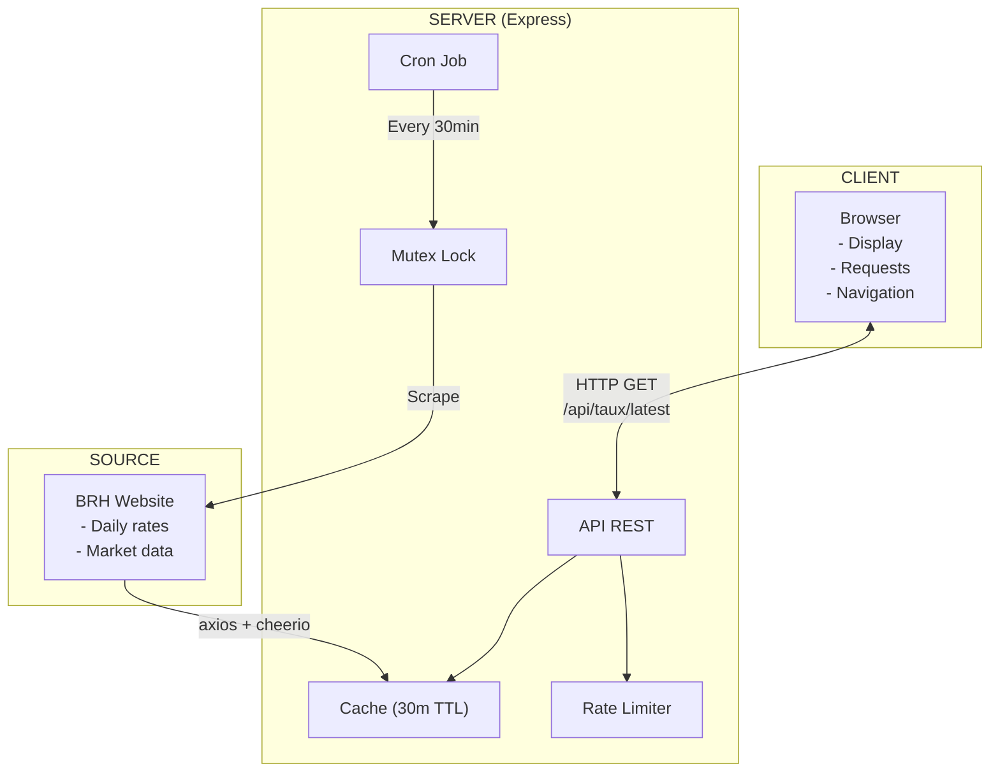
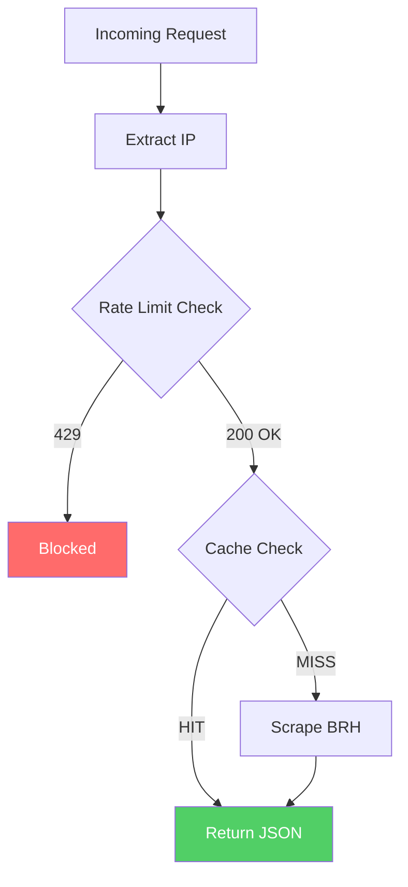
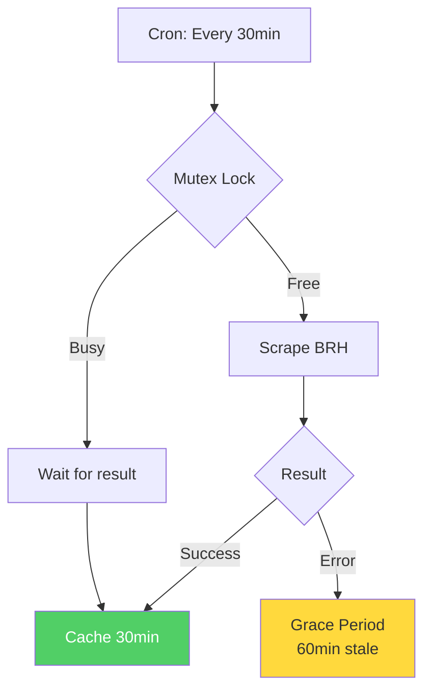
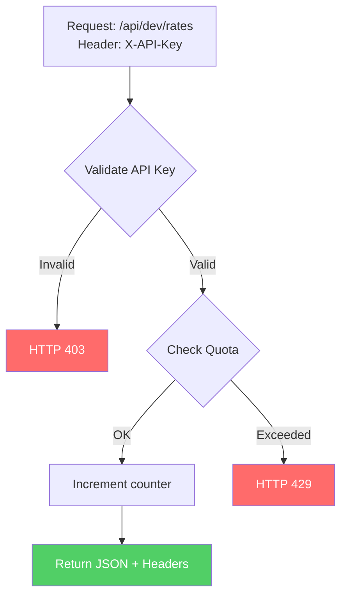
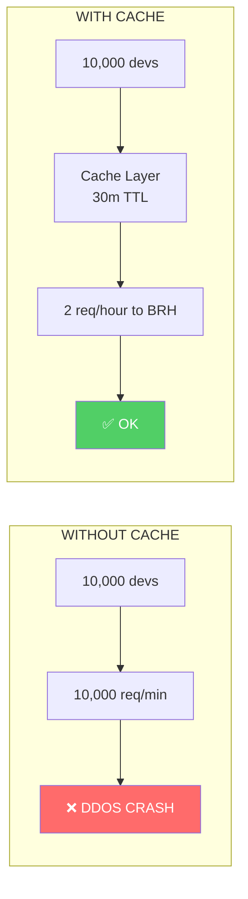

# Taux de Change HTG/USD - API Protégée

Plateforme complète (Backend + Frontend) pour récupérer, stocker et mettre à disposition le taux de change du jour de la Gourde Haïtienne (HTG) vs Dollar Américain (USD), tel que publié par la BRH.

---

## PARTIE 1 : Mini-Cours - Comprendre les APIs

### 1. Qu'est-ce qu'une API ?

Une **API (Application Programming Interface)** est un ensemble de règles et de protocoles qui permet à différentes applications logicielles de communiquer entre elles.

**L'analogie du restaurant** :
Imaginez que vous êtes au restaurant :
- **Vous** = le client/l'application frontend (consultez le menu)
- **La cuisine** = le serveur/la base de données (prépare la nourriture)
- **Le serveur** = l'API (prend votre commande, la transmet au système, vous ramène la réponse)

L'API est l'intermédiaire qui permet la communication entre le client et le système backend.

### 2. Les différents types d'API Web

Il existe plusieurs architectures et protocoles pour créer des APIs sur le web :

| Type | Description | Cas d'usage |
|------|-------------|-----------|
| **SOAP** | Protocole strict basé sur XML | Anciens systèmes d'entreprise/bancaires (haute sécurité) |
| **GraphQL** | Langage de requête flexible (Facebook) | Client demande exactement les données nécessaires |
| **REST** | Architecture populaire utilisant HTTP (GET, POST, PUT, DELETE) | La plupart des APIs modernes, format JSON |

### 3. L'API RESTful (celle du projet)

Une **API RESTful** est :
- **Stateless** (sans état) : Chaque requête contient toutes les informations nécessaires pour être comprise
- **Basée sur HTTP** : Utilise les méthodes GET, POST, PUT, DELETE
- **Expose des Endpoints** : Points de terminaison comme `/api/v1/taux-change`
- **Retourne JSON** : Format standard et lisible

**Exemple d'endpoint RESTful** :
```
GET /api/taux/latest
```
Retourne :
```json
{
  "devise_source": "USD",
  "devise_cible": "HTG",
  "taux_achat": 130.64,
  "taux_vente": 131.53,
  "date_mise_a_jour": "2026-03-28T10:00:00Z"
}
```

---

## PARTIE 2 : Énoncé du Projet

### Contexte
Les entreprises, développeurs et citoyens ont constamment besoin du taux de référence journalier de la gourde haïtienne (HTG) vs dollar américain (USD), publié par la BRH (Banque de la République d'Haïti).

### Objectif
Développer une plateforme complète (Backend + Frontend) qui récupère, stocke et met à disposition le taux de change du jour.

### Fonctionnalités livrées

**1. Le Moteur de l'API (Backend)** ✓
- Scraping automatique du site BRH (https://www.brh.ht/taux-du-jour/)
- Endpoint API public `/api/taux/latest` retournant JSON formaté
- Format JSON exact demandé avec devise_source, devise_cible, taux_achat, taux_vente, date_mise_a_jour

**2. L'Interface Utilisateur (Frontend)** ✓
- Page web user-friendly affichant le taux du jour en grand format
- Section "Espace Développeurs" avec documentation complète
- Exemples de code JavaScript, Python, PHP, cURL
- Navigation intuitive vers sections clés

---

## 📋 Architecture

### Arborescence du projet
```
./
├── server.js              # Backend Express avec protections
├── package.json           # Dépendances
├── public/
│   └── index.html         # Frontend Monolith Style
└── README.md             # Documentation
```

### Mermaid Diagrams - System Architecture

#### 1. System Overview



#### 2. Request Flow with Rate Limiting



#### 3. Data Refresh Cycle (BRH Protection)



#### 4. API Key Authentication Flow



#### 5. Protection Comparison



---

## 🚀 Démarrage

```bash
pnpm install
node server.js
```

Le serveur démarre sur `http://localhost:3000`

---

## 🔐 PARTIE 3 : Protection de la Source et de l'API

### 1. Protection de la Source (BRH) - Anti-DDoS

**Problématique** : Si 10 000 développeurs font des requêtes chaque minute, et que pour chaque requête nous scrapons le site BRH, nous allons "faire tomber" leur serveur.

**Solution implémentée** : Cache avec TTL (Time To Live)

| Mécanisme | Description |
|-----------|-------------|
| **Cache TTL** | Données mises en cache pendant 30 minutes |
| **Verrou (Mutex)** | Une seule requête BRH à la fois, même avec 10 000 utilisateurs simultanés |
| **Grace Period** | Si BRH est inaccessible, on garde les données "stale" jusqu'à 60 minutes |
| **Cron Job** | Rafraîchissement automatique toutes les 30 minutes, jamais à la demande |
| **Fallback** | Valeurs par défaut (130.64 / 131.53) si tout échoue |

**Code clé** (server.js:122-210) :
```javascript
// Verrou: une seule requete BRH à la fois
if (isFetching) {
  await waitForCurrentFetch();
  return cachedRate;
}

// Verification TTL avant scraping
if (age < CACHE_CONFIG.ttlMinutes) {
  return cachedRate; // Pas de requete BRH!
}
```

### 2. Protection de l'API - Rate Limiting

**Problématique** : Un développeur malveillant (ou maladroit) pourrait spammer l'API de millions de requêtes par seconde.

**Solutions implémentées** :

#### A. Rate Limiting par IP (Routes publiques)

| Paramètre | Valeur |
|-----------|--------|
| Fenêtre | 15 minutes |
| Limite | 100 requêtes par IP |
| Headers | `X-RateLimit-*` pour tracking |

**Route** : `GET /api/taux/latest`

**Code clé** (server.js:68-83) :
```javascript
const generalLimiter = rateLimit({
  windowMs: 15 * 60 * 1000,  // 15 minutes
  max: 100,                   // 100 requetes max
  handler: (req, res) => {
    console.warn(`[RATE LIMIT] IP: ${req.ip}`);
    res.status(429).json({ error: 'Trop de requetes' });
  }
});
```

#### B. API Key Authentication (Routes développeur)

| Clé | Tier | Limite quotidienne |
|-----|------|-------------------|
| `dev-demo-key-001` | Free | 1000 requêtes/jour |
| `dev-pro-key-002` | Pro | 10000 requêtes/jour |

**Route protégée** : `GET /api/dev/rates?api_key=DEV_KEY`

**Headers de réponse** :
```
X-RateLimit-Limit: 1000
X-RateLimit-Remaining: 999
X-RateLimit-Reset: 2026-03-28T23:59:59Z
```

**Code clé** (server.js:86-152) :
```javascript
function requireApiKey(req, res, next) {
  const apiKey = req.headers['x-api-key'];
  const keyData = API_KEYS[apiKey];
  
  // Reset quotidien automatique
  if (now - keyData.lastReset > oneDay) {
    keyData.count = 0;
  }
  
  if (keyData.count >= keyData.dailyLimit) {
    return res.status(429).json({ error: 'Quota depasse' });
  }
}
```

---

## 📡 Endpoints API

### Public (Rate Limited)

| Méthode | Endpoint | Description |
|---------|----------|-------------|
| GET | `/api/taux/latest` | Taux bancaire USD/HTG |
| GET | `/api/taux/informel` | Taux marché informel |
| GET | `/api/health` | Statut du service |

### Développeur (API Key requise)

| Méthode | Endpoint | Auth | Description |
|---------|----------|------|-------------|
| GET | `/api/dev/rates` | API Key | Données + metadata |
| POST | `/api/dev/refresh` | Pro Key | Force rafraîchissement BRH |

---

## 💡 Exemples d'utilisation

### JavaScript (Frontend)
```javascript
const response = await fetch('/api/taux/latest');
const data = await response.json();
console.log(data.taux_achat);  // 130.64
```

### Avec API Key (Développeur)
```javascript
const response = await fetch('/api/dev/rates', {
  headers: { 'X-API-Key': 'dev-demo-key-001' }
});
const data = await response.json();
console.log(data._meta);  // { tier: 'free', requestNumber: 1 }
```

### cURL
```bash
# Public
curl http://localhost:3000/api/taux/latest

# Avec API Key
curl -H "X-API-Key: dev-demo-key-001" \
  http://localhost:3000/api/dev/rates
```

---

## 🛡️ Sécurité

1. **Trust Proxy** : `app.set('trust proxy', 1)` pour obtenir les vraies IPs
2. **Logging** : Toutes les tentatives d'abus sont loguées avec IP
3. **Timeouts** : 10 secondes max sur les requêtes BRH
4. **Stale-While-Revalidate** : Service disponible même si BRH tombe

---

## 📊 Monitoring

```bash
# Health check
curl http://localhost:3000/api/health

# Réponse:
{
  "status": "OK",
  "cacheAgeMinutes": 12,
  "lastFetch": "2026-03-28T03:26:31.676Z"
}
```

---

## 📝 Réponses aux Questions de Reflexion

### Q1: Protection de la source
> Comment récupérer les données BRH sans surcharger leur serveur ?

**Réponse**: 
- **Cache TTL 30 minutes** : Les données sont stockées en mémoire et servies directement
- **Cron job** : Scraping automatique toutes les 30 minutes, jamais à la demande utilisateur
- **Mutex** : Une seule requête BRH simultanée, même avec 10 000 utilisateurs
- **Stale-While-Revalidate** : Données périmées acceptables pendant 60 minutes si BRH down

**Impact** : De 10 000 requêtes/minute sur BRH → **1 requête/30 minutes**

### Q2: Protection de l'API
> Comment limiter l'accès pour éviter le spam ?

**Réponse**:
- **Rate limiting IP** : 100 requêtes/15min par IP (express-rate-limit)
- **API Keys** : Authentification requise pour routes sensibles
- **Quota quotidien** : 1000 req/jour (free) / 10000 req/jour (pro)
- **Headers informatifs** : `X-RateLimit-Remaining` pour que le dev gère son usage

---

## 📄 Licence

Données fournies par la [Banque de la République d'Haïti](https://www.brh.ht)
